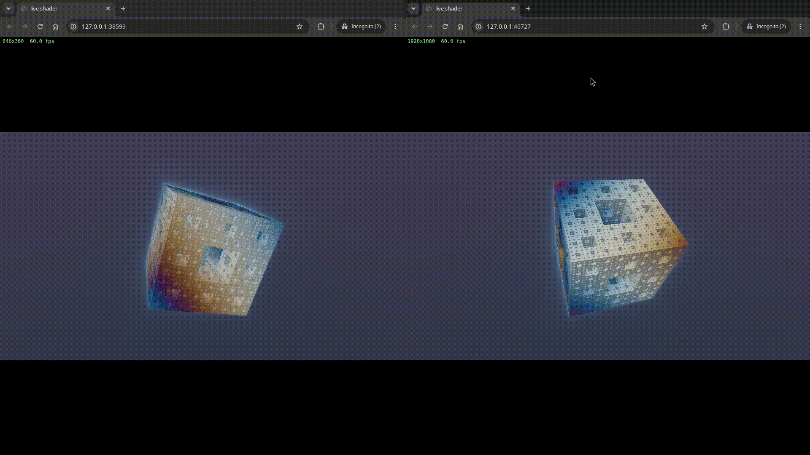

# fragstream

Runs a Shadertoy style fragment shader on the GPU: live in a browser, or without a display to an image, a video or timings.
Needs Docker with the NVIDIA container toolkit.

## Quick start

```sh
$ make build
$ ./stream.sh sponge.frag 480x270
```

`stream.sh` takes a shader and a frame size, prints the address of a live page, and serves it until Ctrl-C.
Open the address in a browser. The page shows its frame rate in the top left, an edited shader shows on reload,
and a size in the address, such as `?size=640x360`, overrides the one given.

To open the page in the browser as soon as the server is up, pipe the address to it:

```sh
$ ./stream.sh sponge.frag 640x360 | xargs -n1 chromium
$ ./stream.sh sponge.frag 1920x1080 | xargs -n1 chromium
```


## Check the GPU

```sh
$ make gpu
```

It lists the GPUs the container can use. A software device here (llvmpipe, lavapipe) means the GPU is not used.

## Test

```sh
$ make run ARGS="sponge.frag --bench 300 --out-res 854x480"   # milliseconds per frame
$ make run ARGS="sponge.frag --out-file out/a.png --at 3"     # one frame, written to out/a.png in this folder
```

## Use

```sh
$ make run ARGS="SHADER [options]"
$ make help
```

Serving live is the default, and `stream.sh` is its short form with a free port picked for you. `--out-file` writes an image
(image suffix) or a video (any other suffix), `--bench` times frames, and `--out-port 0` picks a free port.
A shader kept elsewhere needs a mount for `make run`:

```sh
$ make run EXTRA="-v $HOME/shaders:/shaders:ro" ARGS="/shaders/a.frag"
```

`stream.sh` mounts the shader's folder itself, so it takes a shader from anywhere, as long as the path has no spaces.

## Shaders

One pass, Shadertoy style: a `mainImage` function using `iTime`, `iResolution` and `iFrame`.
No textures, mouse or extra passes. An example is `sponge.frag`.

## Notes

- Two Python packages are pinned together in the `Dockerfile`, because a newer `wgpu` breaks `wgpu-shadertoy`. Change them together.
- The `Dockerfile` installs `libegl1`, without which the NVIDIA Vulkan driver refuses to start in the container.
